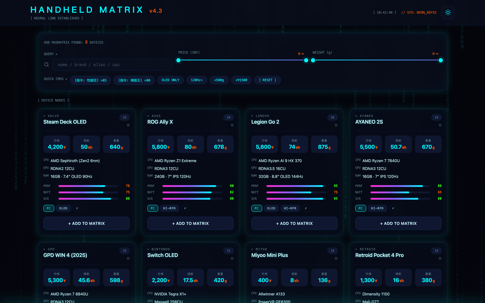

**Contents:**

- [Chinese](README.md)
- [English](README.en.md)
- [Japanese](README.ja.md)

# HANDHELD MATRIX V3.0

A multi-dimensional comparison dashboard for 8 popular handheld consoles: search, filter, score, and radar-chart comparison to help you pick the handheld that fits you best.

🔗 **Use online**: [keng0nion.github.io/HANDHELD-MATRIX-V3.0](https://keng0nion.github.io/HANDHELD-MATRIX-V3.0/)

---

## Features

- **Device cards**: price, battery, weight, screen, and hardware specs for 8 handhelds at a glance, with performance / battery / screen three-bar scoring
- **MATRIX selector**: fuzzy search by name / brand / alias / CPU (Fuse.js), price and weight dual-slider filtering, one-click presets (Performance freak, Pure home console, OLED ONLY, 120Hz+, <500g, <¥1500)
- **MATRIX COMPARE**: check multiple devices to enter the comparison panel — radar chart (Chart.js) + spec comparison table + TOGGLE DIFF highlighting
- **Export poster**: html2canvas one-click export of the current view as an image
- **Dark / light theme toggle**, HUD clock and system status decoration

---

## Included devices

| Device | Brand | Category | Price |
|---|---|---|---|
| Steam Deck OLED | Valve | PC handheld | ¥4,200 |
| ROG Ally X | ASUS | PC handheld | ¥5,800 |
| Legion Go 2 | Lenovo | PC handheld | ¥5,800 |
| AYANEO 2S | AYANEO | PC handheld | ¥5,500 |
| GPD WIN 4 (2025) | GPD | PC handheld | ¥5,300 |
| Switch OLED | Nintendo | Home console | ¥2,200 |
| Miyoo Mini Plus | Miyoo | Retro handheld | ¥400 |
| Retroid Pocket 4 Pro | Retroid | Retro handheld | ¥1,300 |

Prices and specs follow the `devices.json` data (priced in CNY).

---

## Run locally

Pure static single page: after cloning, just double-click `index.html`, or host the whole directory with any static server.

- `index.html` — the page and all logic
- `devices.json` — handheld spec data

External CDN dependencies (Fuse.js, Chart.js, nouislider, html2canvas, Lucide, vanilla-tilt); the first open requires internet.

---

## License

[MIT](./LICENSE)
